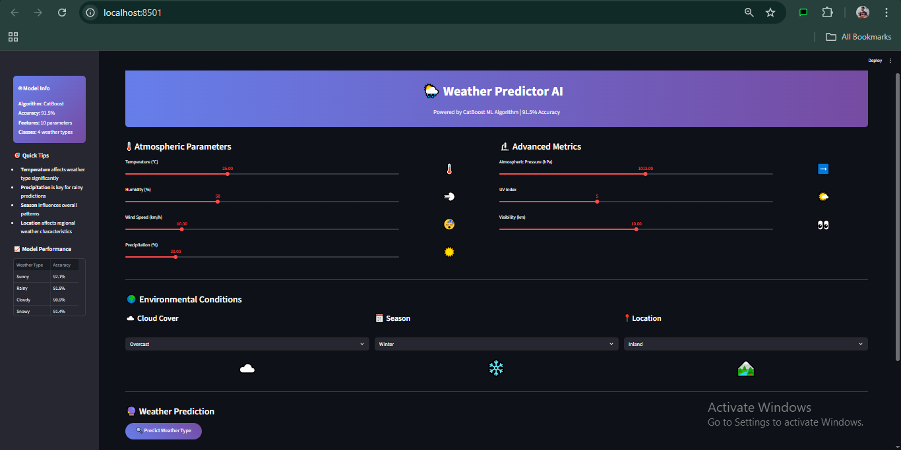
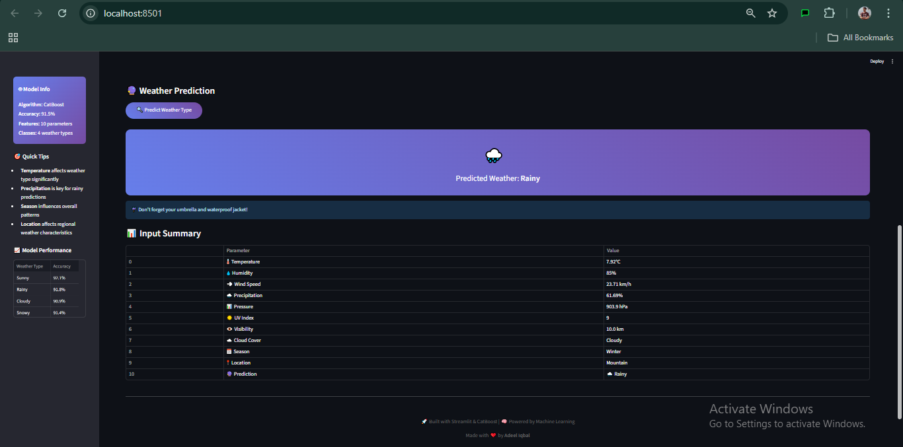

# 🌦️ Weather Predictor AI

🌦️ Weather Predictor AI
An intelligent weather classification system that predicts weather types (Sunny, Rainy, Cloudy, Snowy) based on atmospheric parameters using CatBoost & LightGBM algorithms, featuring a Streamlit web interface, 91.5% accuracy, and comprehensive data preprocessing pipelines with hyperparameter optimization.

## 🚀 Live Demo

**[Try the Weather Predictor App](YOUR_STREAMLIT_LINK_HERE)** 

## 📋 Table of Contents

- [Overview](#overview)
- [Features](#features)
- [Dataset](#dataset)
- [Model Performance](#model-performance)
- [Installation](#installation)
- [Usage](#usage)
- [Project Structure](#project-structure)
- [Technical Details](#technical-details)
- [Screenshots](#screenshots)
- [Contributing](#contributing)
- [Contact](#contact)

## 🌟 Overview

This project implements a comprehensive weather prediction system that analyzes multiple atmospheric parameters to classify weather conditions. Using state-of-the-art gradient boosting algorithms, the model achieves over 91% accuracy in predicting weather types.

### Key Highlights
- **91.5% Test Accuracy** with optimized CatBoost model
- **Interactive Streamlit Web App** for real-time predictions
- **Comprehensive Data Analysis** with 13,200 weather observations
- **Multiple ML Models** comparison (Logistic Regression, CatBoost, LightGBM)
- **Production-Ready** with proper preprocessing pipelines

## ✨ Features

- **Multi-Parameter Analysis**: Temperature, Humidity, Wind Speed, Precipitation, Atmospheric Pressure, UV Index, Visibility
- **Categorical Variables**: Cloud Cover, Season, Location
- **Real-time Predictions**: Interactive sliders and dropdowns
- **Model Comparison**: Benchmarked multiple algorithms
- **Robust Preprocessing**: RobustScaler for numerical features, OneHotEncoder for categorical
- **Hyperparameter Optimization**: RandomizedSearchCV for optimal performance
- **Dynamic Visual Indicators**: Real-time emoji changes based on parameter values
- **Modern UI Design**: Gradient backgrounds and responsive layout
- **Interactive Feedback**: Visual cues and weather recommendations
- **Comprehensive Results**: Detailed input summary with predictions

## 📊 Dataset

The model is trained on a comprehensive weather dataset containing:

- **13,200 observations** across different weather conditions
- **11 features** including atmospheric and geographical parameters
- **4 weather types**: Sunny, Rainy, Cloudy, Snowy (equally distributed)
- **3 locations**: Inland, Mountain, Coastal
- **4 seasons**: Winter, Spring, Summer, Autumn

### Feature Distribution
- **Temperature**: -25°C to 109°C
- **Humidity**: 20% to 109%
- **Wind Speed**: 0 to 48.5 km/h
- **Precipitation**: 0% to 109%
- **Atmospheric Pressure**: 800.12 to 1199.21 hPa
- **UV Index**: 0 to 14
- **Visibility**: 0 to 20 km

## 🎯 Model Performance

| Model | Train Macro-F1 | Test Macro-F1 | Overfitting |
|-------|----------------|---------------|-------------|
| **CatBoost (Tuned)** | 98.2% | **91.5%** | 6.8% |
| LightGBM (Tuned) | 100% | 91.3% | 8.5% |
| CatBoost (Untuned) | 99.2% | 91.5% | 7.7% |
| LightGBM (Untuned) | 100% | 91.4% | 8.6% |
| Logistic Regression | 87.1% | 86.9% | 0.2% |

**Best Model**: CatBoost with optimized hyperparameters
- **Iterations**: 500
- **Depth**: 5
- **Learning Rate**: 0.1

## 🛠️ Installation

### Prerequisites
- Python 3.7+
- pip

### Setup

1. **Clone the repository**
   ```bash
   git clone https://github.com/adeel-iqbal/weather-predictor-ai.git
   cd weather-predictor-ai
   ```

2. **Install dependencies**
   ```bash
   pip install -r requirements.txt
   ```

3. **Run the Streamlit app**
   ```bash
   streamlit run app.py
   ```

### Requirements
```
streamlit>=1.28.0
pandas>=1.5.3
numpy>=1.24.3
scikit-learn>=1.3.0
catboost>=1.2
lightgbm>=4.0.0
matplotlib>=3.7.0
seaborn>=0.12.0
joblib>=1.3.0
```

## 🎮 Usage

### Web Application

1. Launch the Streamlit app
2. Adjust the weather parameters using interactive sliders:
   - Temperature, Humidity, Wind Speed
   - Precipitation, Atmospheric Pressure
   - UV Index, Visibility
3. Select categorical parameters:
   - Cloud Cover (Overcast/Partly Cloudy/Clear/Cloudy)
   - Season (Winter/Spring/Summer/Autumn)
   - Location (Inland/Mountain/Coastal)
4. Click "Predict Weather Type" for instant results

### Jupyter Notebook

Explore the complete analysis in `weather_predictor.ipynb`:
- Data exploration and visualization
- Feature engineering and preprocessing
- Model training and comparison
- Hyperparameter optimization
- Performance evaluation

## 📁 Project Structure

```
weather-predictor-ai/
│
├── assets/
│   ├── image1.png          # App screenshot 1
│   └── image2.png          # App screenshot 2
│
├── app.py                          # Streamlit web application
├── weather_predictor.ipynb         # Complete analysis notebook
├── weather_classification_data.csv # Training dataset
├── catboost_weather_model.pkl      # Trained CatBoost model
├── label_encoder.pkl               # Label encoder for weather types
├── requirements.txt                # Python dependencies
└── README.md                       # Project documentation
```

## 🔧 Technical Details

### Data Preprocessing
- **Numerical Features**: RobustScaler for outlier-resistant scaling
- **Categorical Features**: OneHotEncoder with unknown value handling
- **Target Encoding**: LabelEncoder for weather type classification

### Model Architecture
- **Pipeline Integration**: Seamless preprocessing and prediction
- **Cross-Validation**: 3-fold CV for robust model evaluation
- **Hyperparameter Tuning**: RandomizedSearchCV with macro-F1 scoring

### Performance Metrics
- **Primary Metric**: Macro-F1 Score (handles class imbalance)
- **Secondary Metrics**: Accuracy, Precision, Recall per class
- **Overfitting Analysis**: Train vs Test performance comparison

### User Interface
- **Responsive Layout**: Two-column design for optimal space utilization
- **Visual Feedback**: Dynamic icons that change based on input values
- **Modern Styling**: CSS gradients and animations for enhanced user experience
- **Sidebar Information**: Model performance metrics and usage tips

## 📸 Screenshots

### Main Interface


### Prediction Results


## 🤝 Contributing

Contributions are welcome! Here's how you can help:

1. **Fork the repository**
2. **Create a feature branch**
   ```bash
   git checkout -b feature/amazing-feature
   ```
3. **Commit your changes**
   ```bash
   git commit -m 'Add amazing feature'
   ```
4. **Push to the branch**
   ```bash
   git push origin feature/amazing-feature
   ```
5. **Open a Pull Request**

### Ideas for Contribution
- Add more weather types (Foggy, Stormy, etc.)
- Implement ensemble methods
- Add weather forecast visualization
- Integrate real-time weather data APIs
- Improve UI/UX design

## 📞 Contact

**Adeel Iqbal**
- 📧 Email: [adeelmemon096@yahoo.com](mailto:adeelmemon096@yahoo.com)
- 💼 LinkedIn: [linkedin.com/in/adeeliqbalmemon](https://linkedin.com/in/adeeliqbalmemon)
- 🐙 GitHub: [@adeel-iqbal](https://github.com/adeel-iqbal)

---

## 🙏 Acknowledgments

- Weather dataset for comprehensive atmospheric data
- Streamlit for the amazing web app framework
- CatBoost and LightGBM teams for excellent ML libraries
- Open source community for continuous inspiration

---

<div align="center">

**⭐ If you found this project helpful, please give it a star! ⭐**

Made with ❤️ by [Adeel Iqbal](https://github.com/adeel-iqbal)

</div>
